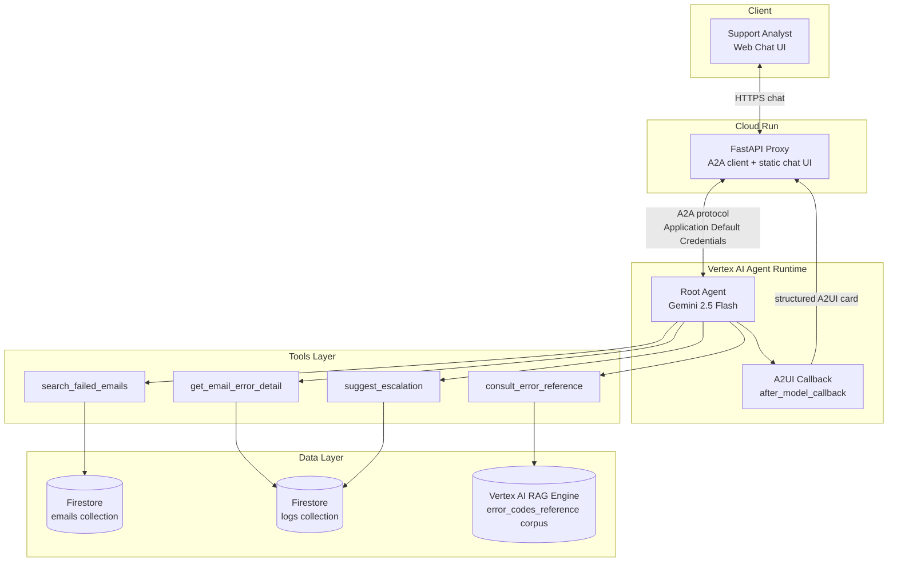
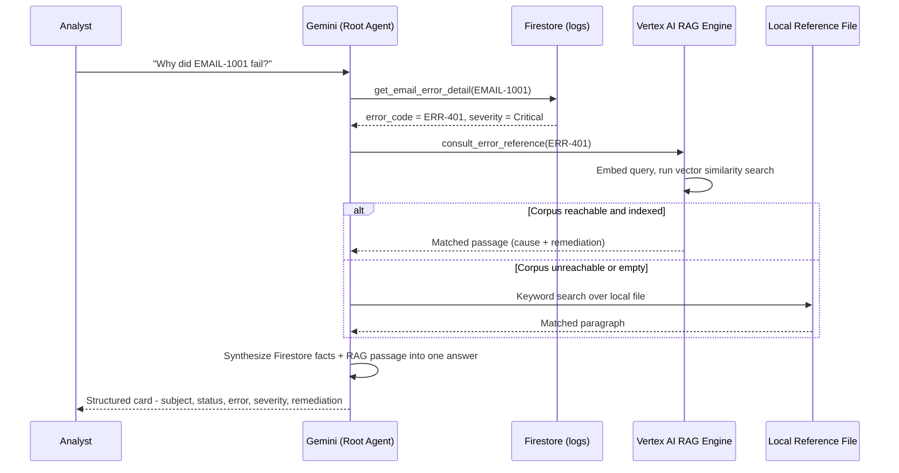
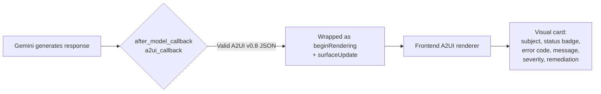

Email Triage Assistant — Architecture Overview

A reference document for architecture review.

1. Executive Summary

The Email Triage Assistant is an agentic system that lets L1/L2 support
analysts diagnose failed email-processing incidents in natural language,
instead of manually correlating a database, flow logs, and a runbook. It
combines structured data retrieval (Firestore), **grounded knowledge
retrieval** (Vertex AI RAG Engine), deterministic business rules (plain
Python), and generative synthesis (Gemini) into a single conversational
interface, deployed as a managed agent with a web front end.

2. System Architecture

Deployment boundaries:
Component
Hosted on
Notes
Root agent + tools
Vertex AI Agent Runtime (Reasoning Engine)
Single deployed agent; owns its own service account
Frontend (proxy + UI)
Cloud Run
Only component the browser talks to; separate service identity
Structured data
Firestore (Native mode)
Two collections: emails, logs
Knowledge base
Vertex AI RAG Engine
One corpus, indexed from a single reference document

The frontend and the agent are independently deployed services — the
browser never talks to Agent Runtime directly, and the agent has no
knowledge of the frontend. This separation means either can be redeployed,
scaled, or replaced without touching the other.

3. Functional / Data Structure

3.1 Firestore — emails collection

Field
Type
Description
email_id
string
Primary identifier (e.g. EMAIL-1001)
subject
string
Email subject line
sender
string
Sender address
status
string enum
Received | Processed | Failed
received_date
timestamp
When the email arrived
error_code
string, nullable
Populated only when status = Failed

3.2 Firestore — logs collection

Field
Type
Description
email_id
string (FK)
Links back to the emails collection
error_message
string
Raw error text from the processing flow
flow_name
string
Which automation flow failed
timestamp
timestamp
When the failure was logged
severity
string enum
Warning | Error | Critical

3.3 Vertex AI RAG Engine — knowledge corpus

Attribute
Value
Source document
error_codes_reference.txt (single file)
Entry format
<code>: <common cause>. Remediation: <steps>.
Retrieval method
Embedding similarity search, top-k passages
Fallback
Local keyword search over the same bundled file if the corpus is unreachable

This corpus is intentionally decoupled from the live data — it's an
operational runbook, updated independently of the incident data pipeline.

3.4 Function Tools

Tool
Input
Data source
Output
search_failed_emails
start_date, end_date
Firestore emails
Count + list of failed emails in range
get_email_error_detail
email_id
Firestore logs
Error message, flow name, timestamp, severity
consult_error_reference
error_code
RAG corpus (+ local fallback)
Cause + remediation guidance passage
suggest_escalation
email_id
Firestore logs (deterministic rule, no LLM)
recommend_escalation: true/false + reason

Escalation rule (deterministic, not model-judged):
recommend_escalation = (severity == "Critical") OR (error_code occurs 3+ times in logs)

4. RAG Flow — How Grounding Actually Works

Separation of concerns:
Question type
Answered by
"What happened?" (the raw fact)
Firestore — live, structured, changes constantly
"What does this mean, and what do I do?" (the knowledge)
RAG corpus — curated, versioned independently, rarely changes
"Should this be escalated?" (the decision)
Deterministic rule — same input always gives same output
"How do I phrase this for the analyst?" (the presentation)
Gemini — synthesizes the above into natural language + structured card

This is the core architectural principle worth highlighting: the LLM never
invents the error meaning or the escalation decision — it only orchestrates
tool calls and composes the final response. Facts, knowledge, and rules each
come from a dedicated, auditable source.

5. Response Rendering (A2UI)

The agent's system prompt (built via A2uiSchemaManager) constrains output to
a small set of components — Card, Column, Row, Text, Image — so the
model produces consistent, renderable structure rather than freeform
markdown.
