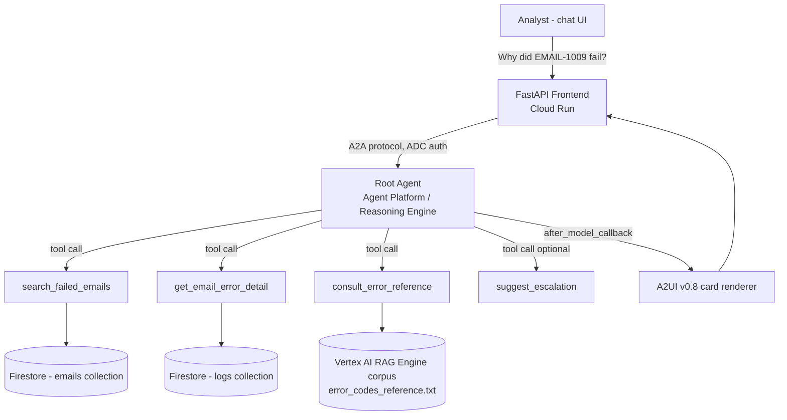
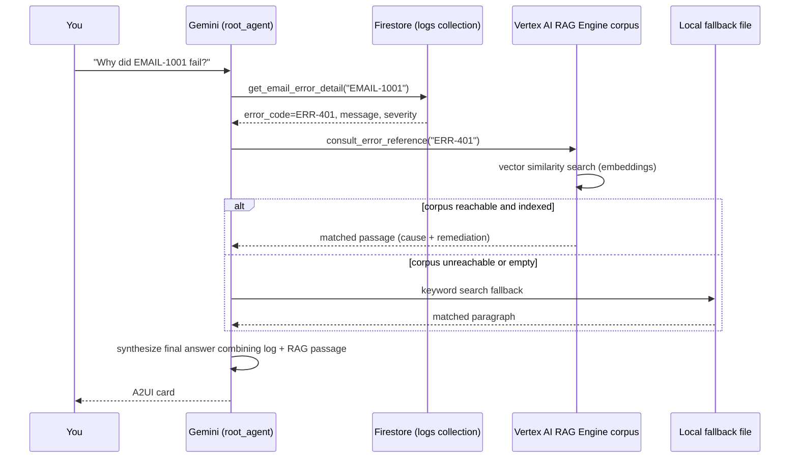

Email Triage Assistant — Build Log

A complete record of how this agent was built during the Gemini World Tour ·
Track 3 lab: every prompt given to Antigravity (AGY), what each tool does, and
how the finished agent was tested and verified.

Repo: https://github.com/amityksharma-hub/email-triage-assistant

1. Project Brief

# Email Triage Assistant

## What it does
An agentic assistant for L1/L2 support analysts to troubleshoot failed email
processing without manually querying a database, opening flow logs, or
searching internal wikis for what an error code means.

## Core user flow
1. Analyst asks: "How many emails failed today?" or "Show me failed emails
   from the last 3 days"
2. Agent queries Firestore "emails" collection, filtered by status=Failed
3. Analyst asks: "Why did email X fail?"
4. Agent looks up the Firestore "logs" collection entry for that email and
   explains the error
5. Agent consults a grounded reference document (RAG) to explain what the
   error CODE means, common causes, and recommended remediation steps —
   instead of just surfacing the raw log message
6. Agent renders the result as a structured card (subject, status, error,
   severity, remediation guidance)

## Data model (Firestore)
Collection: emails
  - email_id (string)
  - subject (string)
  - sender (string)
  - status (string: Received | Processed | Failed)
  - received_date (timestamp)
  - error_code (string, nullable)

Collection: logs
  - email_id (string, foreign key)
  - error_message (string)
  - flow_name (string)
  - timestamp (timestamp)
  - severity (string: Warning | Error | Critical)

## RAG Corpus: Known Error Codes Reference
A single reference document ("error_codes_reference.txt") indexed into a
Vertex AI RAG Engine corpus with 10 error code entries (code, common cause,
remediation).

## Tools to implement
1. search_failed_emails(start_date, end_date) → list of failed emails with counts
2. get_email_error_detail(email_id) → Firestore log entry for that email
3. consult_error_reference(error_code) → RAG query against the error codes
   corpus, returns cause + remediation guidance
4. (stretch) suggest_escalation(email_id) → rule-based: if severity ==
   Critical or same error_code repeated 3+ times → recommend escalation

## Out of scope for this POC
- Memory Bank (not needed for this demo)
- Image/video generation (not relevant to this domain)
- Code execution sandbox (not needed)

## UI
A2UI card showing: email subject, status badge, error code, error message,
severity, and remediation guidance pulled from the RAG tool.

## Frontend
Simple chat UI, rebranded "Email Triage Assistant" with a professional
blue/teal color scheme.

2. Architecture

Deployment topology:
Agent → deployed once to Vertex AI Agent Runtime / Reasoning Engine (us-central1)
Frontend → separate FastAPI proxy + static chat UI, deployed to Cloud Run (us-central1)
The browser only ever talks to the Cloud Run proxy; the proxy talks to the
  deployed agent over the A2A protocol using Application Default Credentials

3. Function Tools — Detail

Tool
Signature
Backing store
What it does
search_failed_emails
(start_date, end_date)
Firestore emails collection
Queries emails where status == "Failed" within a date range; returns a count + list (subject, error_code, received_date)
get_email_error_detail
(email_id)
Firestore logs collection
Looks up the log row for a given email_id; returns error_message, flow_name, timestamp, severity
consult_error_reference
(error_code)
Vertex AI RAG Engine corpus (+ local file fallback)
Embeds the error code, runs a vector similarity search against the indexed error_codes_reference.txt corpus, returns the matched cause + remediation passage. Falls back to a local keyword search over the same file (bundled inside app/) if the RAG call fails or returns empty
suggest_escalation
(email_id)
Firestore logs collection (deterministic Python, no LLM)
Looks up the log entry; recommends escalation if severity == "Critical" OR the same error_code appears 3+ times across all seeded logs

Why suggest_escalation is not an LLM judgment call: escalation criteria
need to be consistent every time for the same input — a rule-based function
guarantees that, whereas asking the model to "decide" could vary between runs.

Known data limitation: the seed dataset has 7 failed emails, each with a
different error code, so the "repeated 3+ times" branch of
suggest_escalation is implemented but not exercised by this dataset — only
the severity == Critical branch fires in this POC.

4. RAG Flow — How grounding actually works

Key point: Firestore answers "what happened" (the raw error); RAG answers
"what does this mean and what do I do about it" (grounded remediation
knowledge). Keeping the runbook (RAG corpus) separate from live incident data
(Firestore) means the runbook can be updated independently of the data
pipeline.

5. Exact Prompt Sequence (in order, as run in AGY)

Step 0a — Clone the lab starter repo
Download and setup https://github.com/cszhu/build-with-gemini

Step 0b — Scaffold the basic agent
Use agents-cli to build a simple agent I can test and run it locally.

Step 0c — Launch Playground + first test
Launch agent playground for me.
Test my agent with the message, "What's the weather in New York?"

Step 1 — Save brief + rename
Save this as project_brief.md, then use it to rename my existing agent
project to match it: rename the project folder and update the name in
agents-cli-manifest.yaml and pyproject.toml. Keep the code in app/ unchanged,
don't deploy yet.

[project_brief.md content — see Section 1 above]

Step 2 — Firestore backend + seed data
Give my agent a Firestore backend based on my project_brief.md: two
collections, "emails" and "logs", matching the schema in the brief. Add
function tools search_failed_emails(start_date, end_date) and
get_email_error_detail(email_id). Important: hardcode my project ID as a
string for the Firestore client and seed script. Seed the "emails" collection
with [10 records] and the "logs" collection with [7 records].

Step 3 — RAG corpus for error codes
Create a text file error_codes_reference.txt in the project with [10 error
code entries: code, cause, remediation]. Then set up a Vertex AI RAG Engine
corpus in us-central1, index this document into it, and add a function tool
consult_error_reference(error_code) that queries the corpus and returns the
cause and remediation guidance.

Step 4 — Stretch escalation tool
Add a function tool suggest_escalation(email_id) to my agent. It should look
up the email's log entry via Firestore, and return a recommendation to
escalate to the platform team if severity == "Critical", or if the same
error_code appears 3 or more times across the seeded logs. This should be
deterministic Python logic, not an LLM call.

Step 5 — Playground verification
Restart the agent playground so it picks up my latest changes.
Test my agent with: "Why did EMAIL-1009 fail, and what should I do about it?"

Step 6 — A2UI cards
Use the enable-a2ui skill to add A2UI to my agent: build the system prompt
with A2uiSchemaManager (version 0.8) and the Basic Catalog, copy in
a2ui_utils.py, wire it up as after_model_callback. Render failed email
results as cards showing subject, status badge, error code, error message,
severity, and remediation guidance from the RAG tool.
Restart the agent playground so it picks up my latest changes.
Test my agent with: "Show me failed emails from the last 3 days" and confirm
it renders as A2UI cards, not raw JSON. Turn Token Streaming off if needed.

Step 7 — Redeploy + IAM
Redeploy my agent to Agent Platform.
Grant my deployed agent's service account the roles it needs:
roles/datastore.user for Firestore, and the roles needed for Vertex AI RAG
Engine retrieval access.

Step 8 — Frontend
Using the build-agent-frontend skill, copy its minimal FastAPI proxy and
chat UI template into ./frontend and wire it to my deployed agent using
AGENT_ENGINE_RESOURCE_NAME and AGENT_DIRECTORY. Keep it a plain chat UI.
Rebrand the title and header to "Email Triage Assistant" with a professional
blue/teal color scheme.
Run my frontend locally from the frontend/ folder: install its dependencies,
set AGENT_ENGINE_RESOURCE_NAME and AGENT_DIRECTORY, then start the server on
http://localhost:8080.

Bug fix — empty Firestore/RAG results + raw protobuf output
My frontend has two issues I need fixed:
1. Every Firestore/RAG tool call against the deployed agent is returning
   empty results, even though these exact queries work in the local
   Playground. [root cause: seed_data.json / error_codes_reference.txt lived
   outside app/, so they weren't packaged into the deployed container.] Fix
   by bundling them inside app/ and using relative paths.
2. The frontend chat window is displaying raw protobuf debug output
   (struct_value / fields / string_value) instead of the agent's final
   answer or a rendered A2UI card. Fix frontend/main.py so it only displays
   final text + rendered A2UI cards.

Step 9 — Deploy frontend to Cloud Run
Deploy the frontend to Cloud Run pointing at my AGENT_ENGINE_RESOURCE_NAME
and AGENT_DIRECTORY, and grant the Cloud Run service account
roles/aiplatform.user so it can reach the agent.

Step 10 — Record the demo
Record a demo of my agent. Run it against my deployed frontend, using these
prompts in order, waiting for each reply: [see full 9-prompt QA list in
Section 6]. Save it as full_capability_demo.webm.

Step 11 — Generate README
Generate a README.md for my project. Describe what my agent actually does
based on the code in this repo — list only real, wired-up capabilities
(Firestore, Vertex AI RAG Engine, A2UI, Cloud Run frontend). Do NOT put
ephemeral localhost/Cloud Run/Agent Engine links in the README. Convert
full_capability_demo.webm into an optimized looping GIF and embed it near the
top with a relative path.

Step 12 — Publish to GitHub
Publish my project to GitHub and submit it for swag.

6. Full Test / QA Scenarios

#
Prompt
Tool(s) called
Why this tool
Where RAG comes in
Expected result
1
"How many emails failed in the last 3 days?"
search_failed_emails
Broad/aggregate question, no specific ID
Not used — pure Firestore
Count + list of failed emails
2
"Why did EMAIL-1001 fail, and what should I do about it?"
get_email_error_detail → consult_error_reference
Specific ID → raw log first, then remediation lookup
RAG retrieves ERR-401 passage (cause + remediation)
Critical severity, Dataverse auth failure, CyberArk remediation steps
3
"What does error code ERR-502 mean?"
consult_error_reference only
Question about the code itself, no email_id
Entire answer sourced from RAG corpus
Attachment size >25MB cause/remediation
4
"Should we escalate EMAIL-1008?"
get_email_error_detail → suggest_escalation
"Should we escalate" triggers the rule tool
Not used (deterministic rule)
recommend_escalation: true (severity Critical)
5
"Should we escalate EMAIL-1004?"
same chain
Contrast case — Warning severity
Not used
recommend_escalation: false
6
"Why did EMAIL-9999 fail?"
get_email_error_detail
Tests graceful failure on unknown ID
Not called (no error_code to look up)
"No record found," no hallucination
7
"What does ERR-999 mean?"
consult_error_reference
Tests RAG's negative case
Confirms "no relevant passage found" instead of inventing an answer
Graceful no-match response
8
"Show me failed emails from the last 3 days, then tell me which ones need escalation"
search_failed_emails → suggest_escalation (per email)
Multi-step orchestration in one turn
N/A
List with escalation flags on Critical-severity emails
9
"What did I just ask you?"
none
Tests session/context continuity
N/A
Recalls the previous question correctly

Result: all 9 scenarios recorded in a single demo clip
(full_capability_demo.webm, 1280x720, ~7.6MB) run against the live Cloud Run
frontend, confirming the deployed agent (not just local Playground) works
end-to-end.

7. Deployment Reference

Item
Value
GCP Project
qwiklabs-gcp-01-e10e0dbf7912
Region
us-central1
Agent Runtime resource
projects/502829143688/locations/us-central1/reasoningEngines/4850855635991920640
Cloud Run service
email-triage-frontend
Cloud Run service account
502829143688-compute@developer.gserviceaccount.com
Agent Runtime service account
service-502829143688@gcp-sa-aiplatform-re.iam.gserviceaccount.com
IAM roles granted
roles/datastore.user, roles/aiplatform.user
GitHub repo
https://github.com/amityksharma-hub/email-triage-assistant

*(Note: the Cloud Run/Agent Runtime URLs above belong to a temporary qwiklabs
project and will stop working once the lab environment is torn down — this
log is for reference/explanation purposes, not as live links.)*
